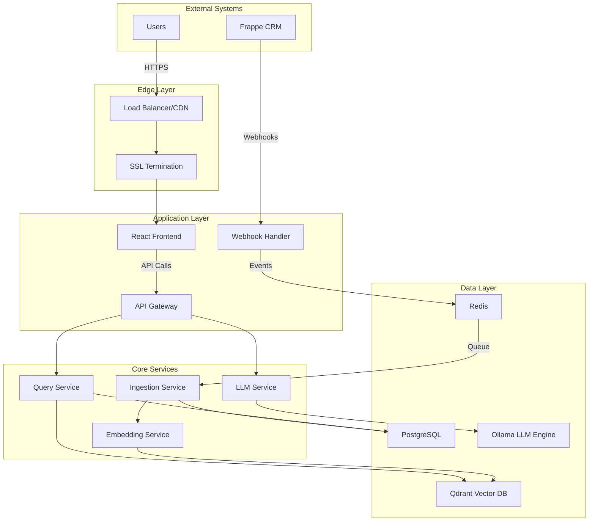

import { Callout, Steps } from 'nextra/components'

# System Architecture

Dossier is built as a **microservices architecture** with clear separation of concerns, designed for scalability, maintainability, and production readiness. The system follows modern distributed system patterns with event-driven communication and stateless services.

## High-Level Architecture



## Core Design Principles

### 1. **Microservices Architecture**
- **Single Responsibility**: Each service has a clear, focused purpose
- **Loose Coupling**: Services communicate through well-defined APIs
- **Technology Diversity**: Best tool for each job (Python, Node.js, React)
- **Independent Deployment**: Services can be deployed and scaled independently

### 2. **Event-Driven Communication**
- **Asynchronous Processing**: Webhook events processed via message queues
- **Decoupled Services**: Services react to events rather than direct calls
- **Resilient Design**: Built-in retry mechanisms and dead letter queues
- **Scalable Processing**: Queue-based load distribution

### 3. **Stateless Services**
- **Horizontal Scaling**: Services can be replicated without session concerns
- **Fault Tolerance**: Service failures don't lose user state
- **Load Distribution**: Requests can be handled by any service instance
- **Cloud Native**: Designed for containerized deployment

### 4. **Data Isolation**
- **Service-Owned Data**: Each service manages its own data store
- **API-First Access**: Data access only through service APIs
- **Consistent Interfaces**: Well-defined data contracts
- **Independent Evolution**: Services can evolve their data models

## Service Components

### Frontend Layer

#### React Frontend
- **Technology**: React 18 + TypeScript + Vite
- **Purpose**: Modern chat interface with real-time streaming
- **Features**:
  - Real-time response streaming via WebSockets
  - Source highlighting and citation display
  - Responsive design for mobile and desktop
  - Authentication state management
  - Dark/light theme support

```typescript
// Example component structure
interface ChatMessage {
  id: string;
  content: string;
  role: 'user' | 'assistant';
  sources?: DocumentSource[];
  timestamp: Date;
}

const ChatInterface = () => {
  const [messages, setMessages] = useState<ChatMessage[]>([]);
  const [isStreaming, setIsStreaming] = useState(false);
  
  const sendMessage = async (query: string) => {
    // Stream response from API Gateway
    const stream = await fetch('/api/chat/stream', {
      method: 'POST',
      body: JSON.stringify({ query }),
      headers: { 'Content-Type': 'application/json' }
    });
    
    // Handle streaming response...
  };
};
```

### Gateway Layer

#### API Gateway
- **Technology**: Python + FastAPI + JWT Authentication
- **Purpose**: Single entry point for all client requests
- **Responsibilities**:
  - Authentication and authorization (JWT tokens)
  - Rate limiting (100 requests/minute default)
  - Request routing to appropriate services
  - CORS handling for frontend integration
  - Request/response logging and metrics

```python
# Example gateway configuration
@app.middleware("http")
async def auth_middleware(request: Request, call_next):
    if request.url.path.startswith("/api/"):
        token = request.headers.get("Authorization")
        if not validate_jwt(token):
            return JSONResponse(
                status_code=401,
                content={"error": "Invalid authentication"}
            )
    return await call_next(request)

@app.post("/api/chat/stream")
async def chat_stream(
    request: ChatRequest,
    user: User = Depends(get_current_user)
):
    # Route to Query Service for processing
    return StreamingResponse(
        query_service.stream_chat(request.query),
        media_type="application/json"
    )
```

#### Webhook Handler
- **Technology**: Node.js + Express
- **Purpose**: Receive and validate Frappe webhooks
- **Features**:
  - HMAC signature validation for security
  - Webhook payload parsing and validation
  - Event publishing to Redis message queue
  - Retry logic with exponential backoff
  - Dead letter queue for failed events

```javascript
// Example webhook processing
app.post('/webhook', (req, res) => {
  // Validate HMAC signature
  const signature = req.headers['x-frappe-signature'];
  if (!validateSignature(req.body, signature)) {
    return res.status(401).json({ error: 'Invalid signature' });
  }
  
  // Parse and validate payload
  const event = parseWebhookEvent(req.body);
  if (!event.isValid()) {
    return res.status(400).json({ error: 'Invalid payload' });
  }
  
  // Publish to message queue
  await redis.lpush('ingestion_queue', JSON.stringify(event));
  res.status(200).json({ status: 'accepted' });
});
```

### Processing Layer

#### Ingestion Service
- **Technology**: Python + AsyncIO + SQLAlchemy
- **Purpose**: Orchestrate document processing workflows
- **Workflow**:
  1. Consume events from Redis queue
  2. Fetch document data from Frappe API
  3. Validate and normalize document content
  4. Send to Embedding Service for vectorization
  5. Store metadata in PostgreSQL
  6. Handle errors and retries

```python
# Example ingestion workflow
class IngestionService:
    async def process_document(self, event: WebhookEvent):
        try:
            # Fetch document from Frappe
            document = await self.frappe_client.get_document(
                event.doctype, 
                event.docname
            )
            
            # Extract and clean text content
            content = self.extract_content(document, event.fields)
            
            # Send for embedding generation
            embedding_job = await self.embedding_service.create_job(
                content=content,
                metadata=document.metadata
            )
            
            # Store processing status
            await self.db.store_ingestion_status(
                document_id=event.docname,
                status='processing',
                job_id=embedding_job.id
            )
            
        except Exception as e:
            await self.handle_error(event, e)
```

#### Embedding Service
- **Technology**: Python + HuggingFace Transformers + Batch Processing
- **Purpose**: Generate vector embeddings for document content
- **Features**:
  - BGE-small model for high-quality embeddings
  - Batch processing for efficiency (32 texts/batch)
  - Intelligent text chunking with overlap
  - Metadata preservation and indexing
  - Automatic Qdrant collection management

```python
# Example embedding generation
class EmbeddingService:
    def __init__(self):
        self.model = SentenceTransformer('BAAI/bge-small-en-v1.5')
        self.chunker = SemanticChunker(
            chunk_size=1000,
            chunk_overlap=200
        )
    
    async def generate_embeddings(self, content: str, metadata: dict):
        # Split content into semantic chunks
        chunks = self.chunker.split_text(content)
        
        # Generate embeddings in batches
        embeddings = []
        for batch in self.batch_chunks(chunks, size=32):
            batch_embeddings = self.model.encode(batch)
            embeddings.extend(batch_embeddings)
        
        # Store in vector database
        await self.qdrant_client.upsert(
            collection_name="documents",
            points=[
                {
                    "id": f"{metadata['doc_id']}_{i}",
                    "vector": embedding.tolist(),
                    "payload": {
                        "content": chunk,
                        "metadata": metadata,
                        "chunk_index": i
                    }
                }
                for i, (chunk, embedding) in enumerate(zip(chunks, embeddings))
            ]
        )
```

#### Query Service
- **Technology**: Python + FastAPI + Async Processing
- **Purpose**: Handle search queries and context retrieval
- **Features**:
  - Semantic similarity search using vector embeddings
  - Metadata filtering and relevance scoring
  - Top-k retrieval with configurable parameters
  - Query result caching for performance
  - Search analytics and logging

```python
# Example query processing
class QueryService:
    async def search(self, query: str, filters: dict = None, limit: int = 5):
        # Generate query embedding
        query_embedding = self.embedding_model.encode([query])[0]
        
        # Search vector database
        search_results = await self.qdrant_client.search(
            collection_name="documents",
            query_vector=query_embedding.tolist(),
            query_filter=self.build_filter(filters),
            limit=limit,
            score_threshold=0.7
        )
        
        # Format and return results
        return [
            {
                "content": result.payload["content"],
                "metadata": result.payload["metadata"],
                "score": result.score,
                "source": result.payload["metadata"]["doc_id"]
            }
            for result in search_results
        ]
```

#### LLM Service
- **Technology**: Python + Ollama + Streaming Responses
- **Purpose**: Generate natural language responses using retrieved context
- **Features**:
  - Local LLM inference (Llama 3.2, CodeLlama)
  - Context injection from search results
  - Streaming response generation
  - Conversation memory and follow-up handling
  - Fallback responses for edge cases

```python
# Example LLM response generation
class LLMService:
    async def generate_response(
        self, 
        query: str, 
        context: List[str],
        conversation_history: List[dict] = None
    ):
        # Build prompt with context
        prompt = self.build_prompt(query, context, conversation_history)
        
        # Stream response from Ollama
        async for chunk in self.ollama_client.generate_stream(
            model=self.default_model,
            prompt=prompt,
            temperature=0.7
        ):
            yield {
                "type": "content",
                "data": chunk["response"]
            }
        
        # Send completion signal
        yield {
            "type": "done",
            "data": {"sources": [ctx["source"] for ctx in context]}
        }
```

### Data Layer

#### PostgreSQL
- **Purpose**: Relational data, configuration, and metadata storage
- **Schema Design**:
  - Document metadata and processing status
  - Doctype configurations and field mappings
  - User authentication and session data
  - System configuration and feature flags
  - Audit logs and processing history

```sql
-- Example schema
CREATE TABLE doctype_configs (
    id SERIAL PRIMARY KEY,
    doctype VARCHAR(100) NOT NULL,
    enabled BOOLEAN DEFAULT true,
    fields JSONB NOT NULL,
    filters JSONB DEFAULT '{}',
    chunk_size INTEGER DEFAULT 1000,
    chunk_overlap INTEGER DEFAULT 200,
    created_at TIMESTAMP DEFAULT NOW(),
    updated_at TIMESTAMP DEFAULT NOW()
);

CREATE TABLE document_status (
    id SERIAL PRIMARY KEY,
    doc_id VARCHAR(255) NOT NULL,
    doctype VARCHAR(100) NOT NULL,
    status VARCHAR(50) NOT NULL,
    processed_at TIMESTAMP,
    error_message TEXT,
    retry_count INTEGER DEFAULT 0,
    created_at TIMESTAMP DEFAULT NOW()
);
```

#### Redis
- **Purpose**: Message queuing, caching, and session storage
- **Usage Patterns**:
  - Webhook event queue (`ingestion_queue`)
  - Processing status cache
  - Rate limiting counters
  - Session storage for authentication
  - Temporary data caching

```python
# Example Redis usage
class RedisManager:
    async def enqueue_document(self, event: dict):
        await self.redis.lpush(
            'ingestion_queue', 
            json.dumps(event)
        )
    
    async def cache_search_result(self, query_hash: str, results: list):
        await self.redis.setex(
            f"search:{query_hash}",
            3600,  # 1 hour TTL
            json.dumps(results)
        )
```

#### Qdrant Vector Database
- **Purpose**: High-performance vector similarity search
- **Configuration**:
  - Document collection with 384-dimensional vectors (BGE-small)
  - Metadata indexing for filtering
  - Optimized for sub-second query response
  - Automatic collection management and optimization

```python
# Example Qdrant configuration
collection_config = {
    "vectors": {
        "size": 384,  # BGE-small embedding dimension
        "distance": "Cosine"
    },
    "optimizers_config": {
        "default_segment_number": 2
    },
    "replication_factor": 1
}
```

#### Ollama LLM Engine
- **Purpose**: Local large language model inference
- **Supported Models**:
  - Llama 3.2 (3B, 8B) - General purpose
  - CodeLlama (7B, 13B) - Code understanding
  - Mistral (7B) - Efficient inference
- **Features**:
  - GPU acceleration support
  - Model switching and management
  - Streaming response generation
  - Memory-efficient inference

## Data Flow

### Document Ingestion Flow

<Steps>

### Webhook Receipt
1. Frappe sends webhook to Webhook Handler
2. HMAC signature validation
3. Event parsing and validation
4. Publish to Redis ingestion queue

### Document Processing
1. Ingestion Service consumes queue event
2. Fetch document from Frappe API
3. Extract and normalize content
4. Store metadata in PostgreSQL

### Embedding Generation
1. Send content to Embedding Service
2. Split text into semantic chunks
3. Generate vector embeddings
4. Store vectors in Qdrant with metadata

### Index Update
1. Update document status in PostgreSQL
2. Invalidate relevant search caches
3. Log processing completion

</Steps>

### Query Processing Flow

<Steps>

### Query Receipt
1. User submits query via Frontend
2. API Gateway authenticates request
3. Route to Query Service

### Semantic Search
1. Generate query embedding
2. Search Qdrant for similar vectors
3. Apply metadata filters
4. Return top-k results with scores

### Response Generation
1. Send query + context to LLM Service
2. Generate streaming response
3. Include source citations
4. Return to Frontend via API Gateway

### Result Display
1. Frontend receives streaming response
2. Display response with source highlighting
3. Update conversation history
4. Cache for follow-up queries

</Steps>

## Scalability Considerations

### Horizontal Scaling
- **Stateless Services**: All services can be replicated
- **Load Balancing**: Distribute requests across service instances
- **Database Sharding**: Partition data for large deployments
- **Queue Partitioning**: Distribute processing load

### Performance Optimization
- **Caching Strategy**: Multi-layer caching (Redis, application, CDN)
- **Connection Pooling**: Efficient database connection management
- **Batch Processing**: Optimize embedding generation throughput
- **Lazy Loading**: Load resources only when needed

### Resource Management
- **Memory Limits**: Configure container resource limits
- **CPU Allocation**: Balance between services based on load
- **Storage Optimization**: Efficient vector storage and indexing
- **Network Optimization**: Minimize inter-service communication

## Security Architecture

### Authentication & Authorization
- **JWT Tokens**: Stateless authentication with configurable expiration
- **API Keys**: Service-to-service authentication
- **Role-Based Access**: Extensible permission system
- **Rate Limiting**: Prevent API abuse and DDoS

### Data Security
- **Encryption at Rest**: Database and vector store encryption
- **Encryption in Transit**: TLS for all API communication
- **Input Validation**: Sanitize all user inputs
- **Audit Logging**: Track all data access and modifications

### Network Security
- **CORS Configuration**: Secure cross-origin resource sharing
- **Firewall Rules**: Restrict network access between services
- **VPC Isolation**: Network-level service isolation
- **Secrets Management**: Secure storage of API keys and tokens

<Callout type="info">
This architecture is designed to be **production-ready** from day one, with built-in monitoring, logging, error handling, and scalability features.
</Callout>