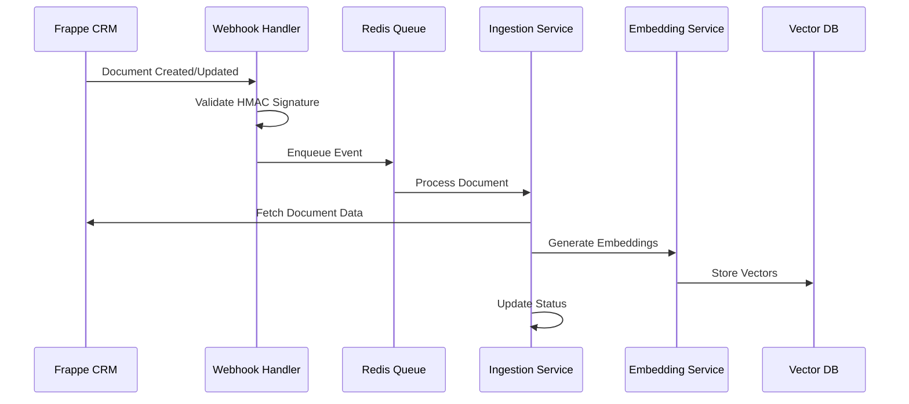

import { Callout, Cards, Card } from 'nextra/components'

# Features Overview

Dossier provides a comprehensive set of features designed to deliver intelligent document search and AI-powered Q&A capabilities for Frappe deployments. Built with production-grade reliability and performance in mind.

## Core Features

### 🚀 Live Document Synchronization

Real-time document ingestion with webhook-based processing ensures your RAG system stays up-to-date with your Frappe instance.

**Key Capabilities:**
- **Real-time Processing**: Documents are indexed within seconds of creation/modification
- **HMAC Validation**: Secure webhook signature verification prevents unauthorized access
- **Retry Logic**: Exponential backoff for failed processing with configurable attempts
- **Dead Letter Queue**: Manual review of failed documents with detailed error logging
- **Selective Ingestion**: Configure which doctypes and fields to process



**Configuration Example:**
```env
# Webhook security
WEBHOOK_SECRET=your_secure_webhook_secret
FRAPPE_URL=https://your-frappe-instance.com
FRAPPE_API_KEY=your_api_key
FRAPPE_API_SECRET=your_api_secret

# Processing settings
RETRY_ATTEMPTS=3
RETRY_DELAY=5
DEAD_LETTER_ENABLED=true
```

### 🧩 Intelligent Text Chunking

Advanced text processing that understands document structure and maintains semantic coherence.

**Chunking Strategy:**
- **Semantic Boundaries**: Respects sentence and paragraph structure
- **Configurable Size**: Adjustable chunk size (500-2000 characters)
- **Overlap Management**: Configurable overlap to maintain context
- **Metadata Preservation**: Document metadata attached to each chunk
- **Empty Content Handling**: Graceful handling of documents with minimal content

```python
# Example chunking configuration
chunking_config = {
    "chunk_size": 1000,        # Characters per chunk
    "chunk_overlap": 200,      # Overlap between chunks
    "respect_boundaries": True, # Don't split sentences
    "min_chunk_size": 100,     # Minimum viable chunk
    "metadata_fields": [       # Fields to preserve
        "doctype",
        "creation", 
        "modified",
        "owner"
    ]
}
```

**Supported Content Types:**
- Plain text content from text fields
- Rich text with HTML tag stripping
- JSON field extraction and formatting
- Table data with structured representation
- Multi-language content support

### 🔍 Advanced Vector Search

High-performance semantic search using state-of-the-art embedding models and vector databases.

**Search Capabilities:**
- **Semantic Similarity**: Understanding intent, not just keywords
- **Hybrid Search**: Combine vector similarity with metadata filtering
- **Configurable Relevance**: Adjustable similarity thresholds
- **Multi-modal Queries**: Support for different query types
- **Real-time Results**: Sub-2-second response times

```python
# Example search query
search_result = await query_service.search(
    query="customers with high revenue",
    filters={
        "doctype": "Customer",
        "disabled": 0,
        "creation": {"$gte": "2024-01-01"}
    },
    limit=10,
    threshold=0.7
)
```

**Embedding Models:**
- **BGE-small-en-v1.5**: Default model (384 dimensions)
- **all-MiniLM-L6-v2**: Alternative lightweight option
- **all-mpnet-base-v2**: Higher quality for specialized use cases
- **Custom Models**: Support for domain-specific embeddings

### 💬 Natural Language Q&A

AI-powered question answering with context-aware responses and source attribution.

**Q&A Features:**
- **Streaming Responses**: Real-time response generation
- **Context Injection**: Relevant document chunks provide context
- **Source Attribution**: Clear citations with confidence scores
- **Conversation Memory**: Multi-turn conversations with context
- **Fallback Handling**: Graceful responses when no relevant content found

```typescript
// Example chat interface
interface ChatResponse {
  content: string;
  sources: Array<{
    document: string;
    score: number;
    excerpt: string;
  }>;
  confidence: number;
  processing_time: number;
}
```

**Supported LLM Models:**
- **Llama 3.2** (3B, 8B): General-purpose conversation
- **CodeLlama** (7B, 13B): Code and technical documentation
- **Mistral 7B**: Efficient inference with good quality
- **Custom Models**: Integration with other Ollama-supported models

### 🛡️ Production-Grade Security

Enterprise-ready security features to protect your data and control access.

**Authentication & Authorization:**
- **JWT Tokens**: Stateless authentication with configurable expiration
- **API Keys**: Service-to-service authentication
- **Role-Based Access**: Extensible permission system
- **Session Management**: Secure session handling with Redis

**Data Protection:**
- **HMAC Validation**: Webhook signature verification
- **Input Sanitization**: Protection against injection attacks
- **Rate Limiting**: Configurable limits to prevent abuse
- **CORS Configuration**: Secure cross-origin resource sharing

```env
# Security configuration
JWT_SECRET=your_secure_jwt_secret_32_chars_minimum
JWT_EXPIRY=3600  # 1 hour
RATE_LIMIT_PER_MINUTE=100
CORS_ORIGINS=["https://your-frontend.com"]
WEBHOOK_SECRET=your_webhook_secret
```

### 📊 Comprehensive Monitoring

Built-in observability features for production deployment and maintenance.

**Monitoring Features:**
- **Health Checks**: Endpoint monitoring for all services
- **Prometheus Metrics**: Request rates, response times, error rates
- **Structured Logging**: JSON logs with correlation IDs
- **Distributed Tracing**: Request flow tracking across services
- **Performance Metrics**: Embedding generation, search, and LLM response times

```yaml
# Example Prometheus metrics
dossier_requests_total{service="query", status="200"} 1234
dossier_response_duration_seconds{service="embedding", quantile="0.95"} 0.045
dossier_embeddings_generated_total 5678
dossier_search_results_returned_total 9012
```

**Available Dashboards:**
- Service health and availability
- Request throughput and latency
- Error rates and failure patterns
- Resource utilization (CPU, memory, disk)
- Business metrics (queries, documents processed)

## Advanced Features

### 🔄 Batch Processing

Efficient processing of large document volumes with optimized resource usage.

- **Embedding Batches**: Process multiple documents simultaneously
- **Queue Management**: Prioritized processing with configurable workers
- **Resource Optimization**: Memory-efficient processing of large datasets
- **Progress Tracking**: Real-time status updates for batch operations

### 🎯 Custom Filtering

Powerful filtering capabilities to narrow search results based on document metadata.

```python
# Advanced filtering examples
filters = {
    "doctype": {"$in": ["Customer", "Lead"]},
    "creation": {"$gte": "2024-01-01"},
    "disabled": 0,
    "custom_field": {"$contains": "priority"}
}
```

### 🔌 API-First Design

RESTful APIs with comprehensive documentation for easy integration.

- **OpenAPI Specification**: Complete API documentation
- **SDK Generation**: Client libraries for popular languages
- **Webhook Support**: Bidirectional integration capabilities
- **Bulk Operations**: Efficient handling of large data operations

### 🌐 Multi-Language Support

Global deployment capabilities with localization support.

- **Unicode Content**: Full UTF-8 support for international content
- **Language Detection**: Automatic language identification
- **Localized Responses**: Context-aware language handling
- **Right-to-Left Support**: UI support for RTL languages

## Performance Characteristics

### Response Times
- **Search Queries**: < 2 seconds typical
- **LLM Responses**: < 30 seconds for complex queries
- **Document Ingestion**: < 10 seconds per document
- **Embedding Generation**: 20+ texts/second

### Scalability
- **Concurrent Users**: 50+ simultaneous users
- **Document Volume**: Tested with 100K+ documents
- **Memory Usage**: < 16GB for full system
- **Storage Efficiency**: ~1GB per 10K documents

### Availability
- **Uptime Target**: 99.9% availability
- **Fault Tolerance**: Automatic service recovery
- **Data Durability**: Persistent storage with backup support
- **Zero-Downtime Updates**: Rolling deployment support

## Integration Capabilities

### Frappe Integration
- **Doctype Configuration**: Flexible field mapping and filtering
- **Real-time Sync**: Immediate processing of document changes
- **Custom Fields**: Support for custom field types and structures
- **Multi-Site**: Support for multiple Frappe instances

### External APIs
- **REST Endpoints**: Complete CRUD operations
- **Webhook Integration**: Bidirectional event processing
- **Export Functions**: Data export in multiple formats
- **Import Tools**: Bulk data import utilities

### Development Tools
- **Docker Support**: Container-first deployment
- **Environment Configs**: Multiple environment support
- **Testing Frameworks**: Comprehensive test suites
- **Development Mode**: Hot reload and debugging support

<Cards>
  <Card title="🚀 Getting Started" href="/getting-started">
    Set up your Dossier instance and start processing documents
  </Card>
  <Card title="⚙️ Configuration" href="/configuration">
    Learn about all configuration options and customization
  </Card>
  <Card title="📚 API Reference" href="/api-reference">
    Complete API documentation for integration
  </Card>
  <Card title="🏗️ Architecture" href="/architecture">
    Deep dive into system design and components
  </Card>
</Cards>

---

<Callout type="info">
**Performance Tip**: For optimal performance, configure chunk sizes and embedding batch sizes based on your document types and available system resources.
</Callout>