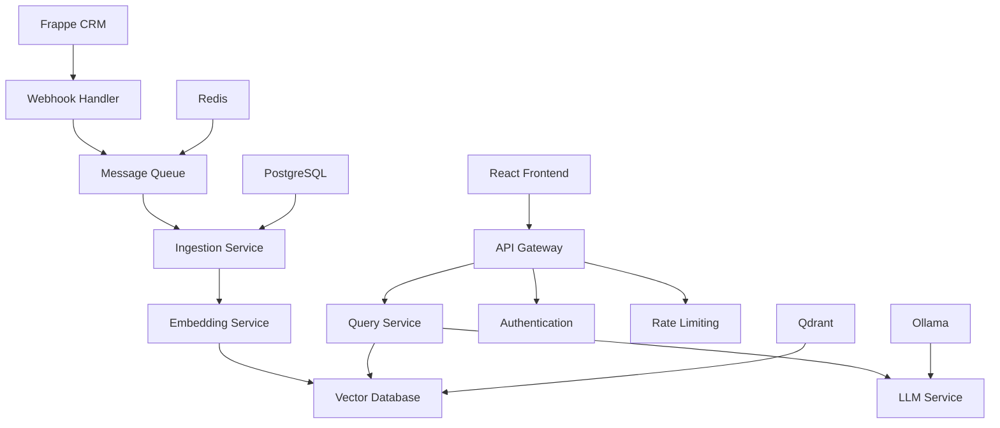

import { Cards, Card } from 'nextra/components'
import { FileText, Zap, Search, MessageCircle, Shield, Cog } from 'lucide-react'


# Dossier Live RAG System

A **production-ready, open-source Live RAG** (Retrieval-Augmented Generation) system designed specifically for **Frappe documents**. Dossier provides real-time document ingestion, intelligent chunking, semantic search, and natural language Q&A capabilities through a modern chat interface.

<div className="mt-16 mb-20">
  <Cards>
    <Card
      icon={<Zap />}
      title="Live Document Sync"
      href="/features/live-sync"
    >
      Real-time webhook processing for automatic document ingestion with retry mechanisms and dead letter queues.
    </Card>
    <Card
      icon={<FileText />}
      title="Intelligent Chunking"
      href="/features/chunking"
    >
      Semantic-aware document splitting with configurable overlap and metadata preservation.
    </Card>
    <Card
      icon={<Search />}
      title="Vector Search"
      href="/features/search"
    >
      High-quality embeddings using BGE-small model with contextual similarity search and filtering.
    </Card>
    <Card
      icon={<MessageCircle />}
      title="Natural Language Q&A"
      href="/features/qa"
    >
      AI-powered responses using local LLM inference with real-time streaming and source highlighting.
    </Card>
    <Card
      icon={<Shield />}
      title="Production Ready"
      href="/deployment"
    >
      Docker-first deployment with comprehensive monitoring, authentication, and rate limiting.
    </Card>
    <Card
      icon={<Cog />}
      title="Extensible Architecture"
      href="/architecture"
    >
      Microservices architecture with clear separation of concerns and Frappe-agnostic design.
    </Card>
  </Cards>
</div>

## Quick Start

Get Dossier running in minutes:

```bash
# Clone the repository
git clone https://github.com/your-org/dossier.git
cd dossier

# Copy and configure environment
cp .env.example .env
# Edit .env with your Frappe instance details

# Start the complete system
make quick-start

# Access the chat interface
open http://localhost:3000
```

## Architecture Overview

Dossier is built as a **microservices architecture** with clear separation of concerns:



### Core Services

- **🔗 Webhook Handler** (Node.js) - Receives and validates Frappe webhooks
- **📄 Ingestion Service** (Python) - Processes documents and manages workflows
- **🧠 Embedding Service** (Python) - Generates vector embeddings using BGE-small
- **🔍 Query Service** (Python) - Handles semantic search and retrieval
- **🤖 LLM Service** (Python) - Generates natural language responses using Ollama
- **🌐 API Gateway** (Python) - Authentication, rate limiting, and request routing
- **⚛️ Frontend** (React) - Modern chat interface with real-time streaming

### Infrastructure Components

- **🐘 PostgreSQL** - Configuration and metadata storage
- **🔴 Redis** - Message queuing and caching
- **🎯 Qdrant** - Vector database for semantic search
- **🦙 Ollama** - Local LLM inference engine

## Key Features

### 🚀 Live Document Synchronization
- Real-time webhook processing with HMAC signature validation
- Automatic document ingestion with exponential backoff retry
- Dead letter queue for failed processing and manual review
- Support for multiple Frappe doctypes with custom field mapping

### 🧩 Intelligent Text Processing
- **Semantic chunking** with configurable size and overlap
- **Metadata preservation** during document processing
- **Batch processing** for optimal performance
- **Graceful handling** of various document formats

### 🔍 Advanced Search & Retrieval
- **Vector similarity search** with sub-2-second response times
- **Metadata filtering** and contextual relevance scoring
- **Top-k retrieval** with configurable parameters
- **Source highlighting** and citation tracking

### 💬 Natural Language Interface
- **Streaming responses** with real-time user feedback
- **Context injection** from retrieved document chunks
- **Conversation memory** and follow-up question handling
- **Fallback responses** for edge cases and errors

### 🛡️ Production-Grade Security
- **JWT authentication** with configurable token expiration
- **Rate limiting** to prevent API abuse (100 req/min default)
- **CORS configuration** for secure frontend integration
- **Input validation** and sanitization across all endpoints

### 📊 Monitoring & Observability
- **Health checks** on all service endpoints (`/health`)
- **Prometheus metrics** collection (`/metrics`)
- **Structured JSON logging** with correlation IDs
- **Distributed tracing** for request flow tracking

## Performance Characteristics

| Metric | Performance |
|--------|-------------|
| **Query Response Time** | < 2 seconds |
| **LLM Response Time** | < 30 seconds |
| **Embedding Generation** | 20+ texts/second |
| **Concurrent Users** | 50+ supported |
| **Memory Usage** | < 16GB total system |
| **Storage Efficiency** | ~1GB per 10K documents |

## System Requirements

### Minimum Requirements
- **CPU**: 4 cores
- **RAM**: 8GB
- **Storage**: 50GB free space
- **Network**: Stable internet connection

### Recommended for Production
- **CPU**: 8+ cores
- **RAM**: 16GB+
- **Storage**: 100GB+ SSD
- **Network**: High-speed connection

## Next Steps

<Cards>
  <Card title="🚀 Quick Start" href="/getting-started">
    Get Dossier running in your environment in under 10 minutes
  </Card>
  <Card title="🏗️ Architecture Deep Dive" href="/architecture">
    Understand the system design and microservices architecture
  </Card>
  <Card title="⚙️ Configuration Guide" href="/configuration">
    Learn about all configuration options and environment variables
  </Card>
  <Card title="🚀 Deployment Guide" href="/deployment">
    Production deployment with Docker, SSL, and monitoring setup
  </Card>
</Cards>

---

## Community & Support

- **📖 Documentation**: Complete guides and API references
- **🐛 Issues**: [GitHub Issues](https://github.com/your-org/dossier/issues) for bug reports
- **💬 Discussions**: [GitHub Discussions](https://github.com/your-org/dossier/discussions) for questions
- **🤝 Contributing
