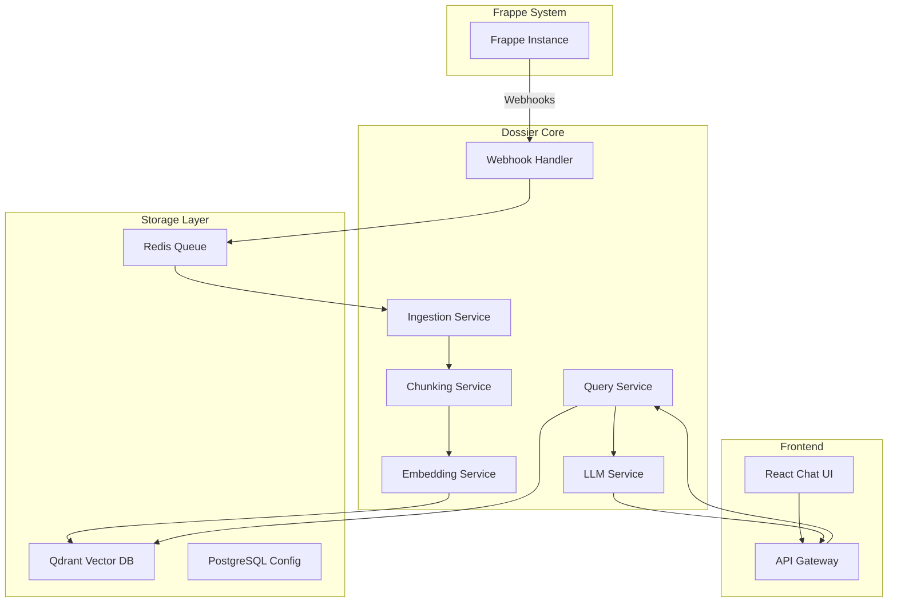

# Design Document

## Overview

Dossier is architected as a microservices-based RAG system with clear separation of concerns. The system consists of a document ingestion service, embedding service, vector storage, LLM service, and a React-based frontend. All components communicate via REST APIs and message queues for scalability and reliability.

## Architecture



## Components and Interfaces

### 1. Webhook Handler Service
- **Purpose**: Receives and validates Frappe webhooks
- **Technology**: Node.js/Express
- **Interfaces**:
  - REST endpoint: `POST /webhooks/frappe`
  - Queue producer: Redis pub/sub
- **Key Functions**:
  - Webhook signature validation
  - Document change detection
  - Queue message publishing

### 2. Document Ingestion Service
- **Purpose**: Processes documents and manages ingestion workflows
- **Technology**: Python/FastAPI
- **Interfaces**:
  - Queue consumer: Redis pub/sub
  - REST API: `/api/ingestion/*`
  - Database: PostgreSQL for configuration
- **Key Functions**:
  - Document fetching from Frappe
  - Field extraction based on configuration
  - Batch processing for manual ingestion

### 3. Chunking Service
- **Purpose**: Intelligent text chunking with semantic preservation
- **Technology**: Python with LangChain
- **Interfaces**:
  - Internal API: Called by Ingestion Service
- **Key Functions**:
  - Recursive text splitting
  - Semantic boundary detection
  - Chunk overlap management
  - Metadata preservation

### 4. Embedding Service
- **Purpose**: Generate and manage vector embeddings
- **Technology**: Python with sentence-transformers
- **Interfaces**:
  - Internal API: Called by Ingestion Service
  - Vector DB: Qdrant client
- **Key Functions**:
  - BGE-small model inference
  - Batch embedding generation
  - Vector storage with metadata

### 5. Query Service
- **Purpose**: Handle search queries and orchestrate retrieval
- **Technology**: Python/FastAPI
- **Interfaces**:
  - REST API: `/api/query/*`
  - Vector DB: Qdrant client
  - LLM Service: Internal API calls
- **Key Functions**:
  - Semantic similarity search
  - Result ranking and filtering
  - Context preparation for LLM

### 6. LLM Service
- **Purpose**: Generate natural language responses
- **Technology**: Python with Ollama client
- **Interfaces**:
  - Internal API: Called by Query Service
  - Ollama: Local model inference
- **Key Functions**:
  - Prompt template management
  - Response streaming
  - Context injection

### 7. Frontend Application
- **Purpose**: User interface for chat interactions
- **Technology**: React, TypeScript, Tailwind CSS
- **Interfaces**:
  - REST API: Communication with backend
  - WebSocket: Real-time streaming
- **Key Functions**:
  - Chat interface
  - Source highlighting
  - Real-time response streaming

## Data Models

### Document Configuration
```typescript
interface DoctypeConfig {
  doctype: string;
  enabled: boolean;
  fields: string[];
  filters: Record<string, any>;
  chunkSize: number;
  chunkOverlap: number;
  lastSync?: Date;
}
```

### Document Chunk
```typescript
interface DocumentChunk {
  id: string;
  doctype: string;
  docname: string;
  fieldName: string;
  content: string;
  metadata: {
    chunkIndex: number;
    totalChunks: number;
    timestamp: Date;
    sourceUrl?: string;
  };
  embedding?: number[];
}
```

### Query Request/Response
```typescript
interface QueryRequest {
  query: string;
  topK?: number;
  filters?: Record<string, any>;
  includeMetadata?: boolean;
}

interface QueryResponse {
  answer: string;
  sources: DocumentChunk[];
  confidence: number;
  processingTime: number;
}
```

## Error Handling

### Webhook Processing
- **Retry Strategy**: Exponential backoff with max 5 retries
- **Dead Letter Queue**: Failed webhooks stored for manual review
- **Monitoring**: Webhook success/failure rates tracked

### Document Ingestion
- **Validation**: Schema validation for all document fields
- **Partial Failures**: Continue processing other documents if one fails
- **Error Logging**: Detailed error logs with document context

### Vector Operations
- **Connection Resilience**: Automatic reconnection to Qdrant
- **Batch Failures**: Retry individual items from failed batches
- **Consistency Checks**: Periodic validation of vector-document mapping

### LLM Generation
- **Timeout Handling**: 30-second timeout for LLM responses
- **Fallback Responses**: Generic responses when LLM fails
- **Rate Limiting**: Request throttling to prevent overload

## Testing Strategy

### Unit Testing
- **Coverage Target**: 90% code coverage
- **Framework**: pytest for Python, Jest for TypeScript
- **Mocking**: Mock external services (Frappe, Qdrant, Ollama)

### Integration Testing
- **API Testing**: Full API endpoint testing with test databases
- **Webhook Testing**: Simulated Frappe webhook scenarios
- **End-to-End**: Complete user journey testing

### Performance Testing
- **Load Testing**: Concurrent user simulation
- **Embedding Performance**: Batch processing benchmarks
- **Query Latency**: Response time under various loads

### System Testing
- **Docker Compose**: Full system testing in containers
- **Configuration Testing**: Various deployment configurations
- **Failure Scenarios**: Network failures, service outages

## Security Considerations

### Authentication
- **Webhook Security**: HMAC signature verification
- **API Security**: JWT-based authentication
- **Rate Limiting**: Per-user and per-IP limits

### Data Protection
- **Encryption**: TLS for all communications
- **Data Sanitization**: Remove sensitive data before embedding
- **Access Control**: Role-based access to different Doctypes

## Deployment Architecture

### Container Strategy
- **Multi-stage Builds**: Optimized Docker images
- **Health Checks**: Kubernetes-ready health endpoints
- **Resource Limits**: CPU and memory constraints

### Configuration Management
- **Environment Variables**: All configuration via env vars
- **Config Validation**: Startup validation of all settings
- **Hot Reloading**: Configuration updates without restart

### Monitoring and Observability
- **Metrics**: Prometheus metrics for all services
- **Logging**: Structured JSON logging
- **Tracing**: Distributed tracing for request flows